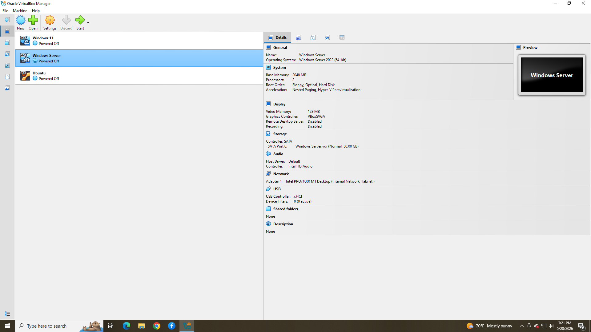
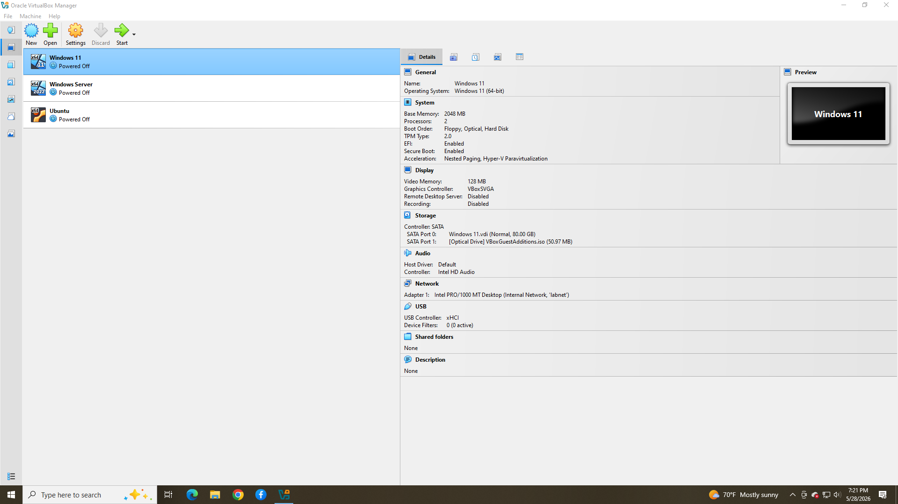
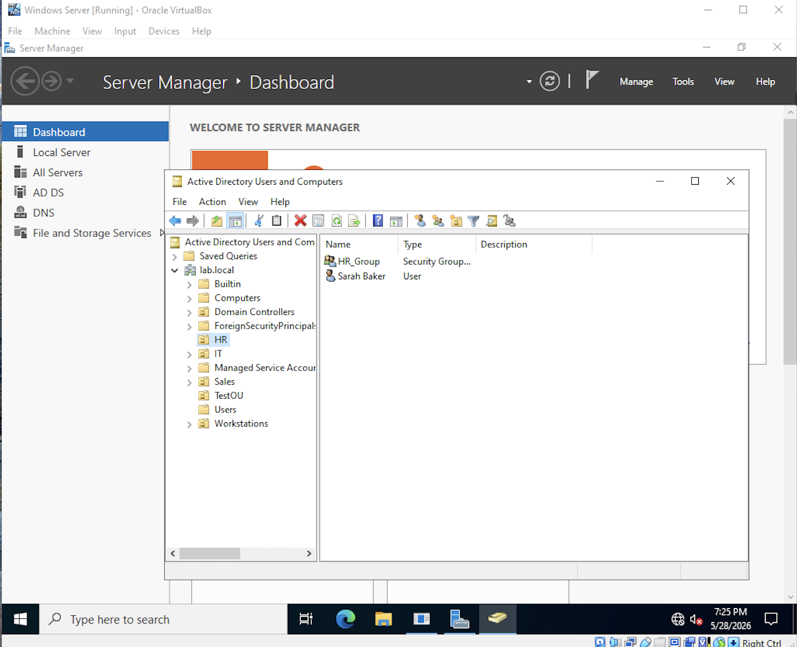
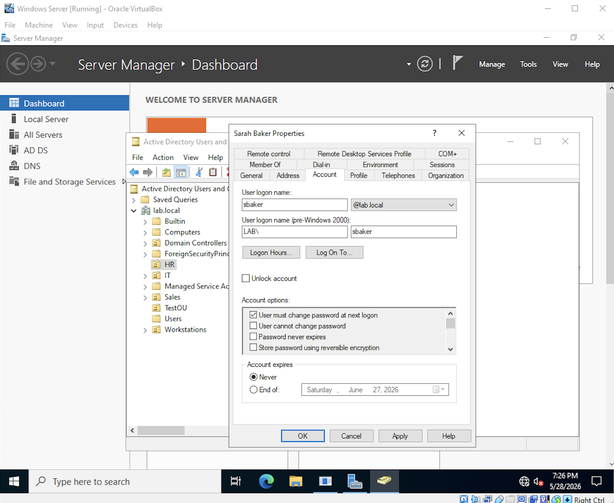
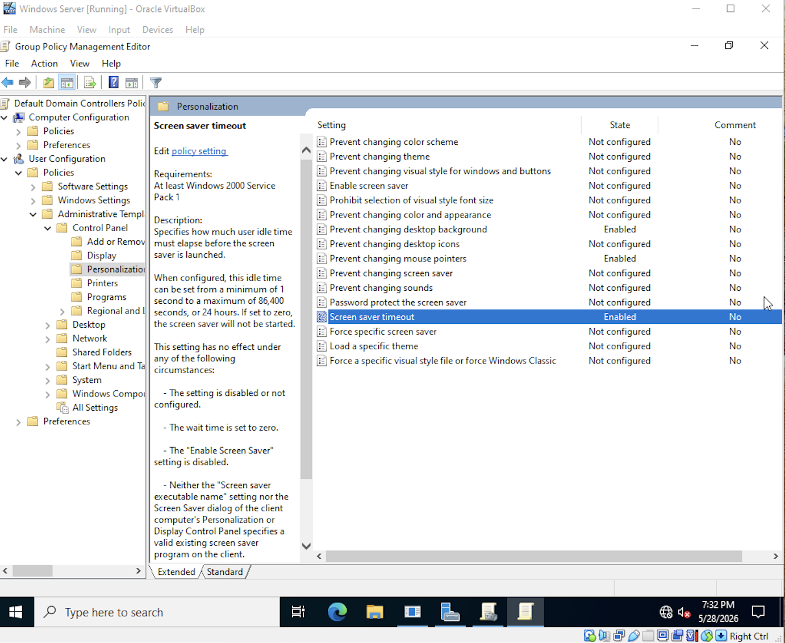

# active-directory-home-lab
Built a simulated enterprise network environment by using VirtualBox to create a Windows Server and Windows 11 Client machines. Configured Active Directory, OUs, Group Policy, User account management, and network configuration.

-------
## Technologies Users
- Windows Server
- Active Directory
- Group Policy
- VirtualBox
- Windows 11
-------

## Virtual Machine Creation
Created a virtual lab environment environment using VirtualBox to simulate a small enterprise network.

### Server Configuration
- Installed Windows Server
- Connected the client machine to the domain
- Applied Group Policy Settings from the server to the client

### Client Configuration
- Installed Windows 11 virtual machine
- Connected the client to the domain
- Tested domain login functionality
- Applied Group Policy settings from the server to the client machine

### Networking
- Configured internal network communication between the server and client VMs
- Verified connectivity using ping and domain authentication tests
________

## Active Directory User Configurations
Created and managed:
- Organizational Units (OUs)
- User accounts
- Security groups
- Administrative permissions

________

## Group Policy Management
Configured Group Policy settings to manage:
- User restrictions
- System behavior
- Administrative controls
- Desktop and Control Panel access

